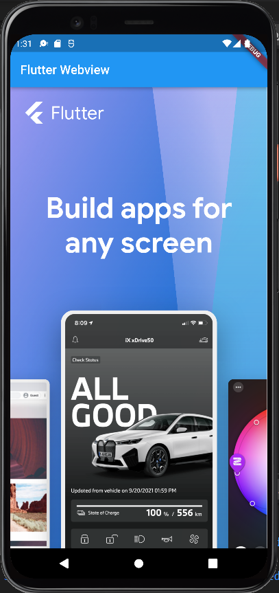
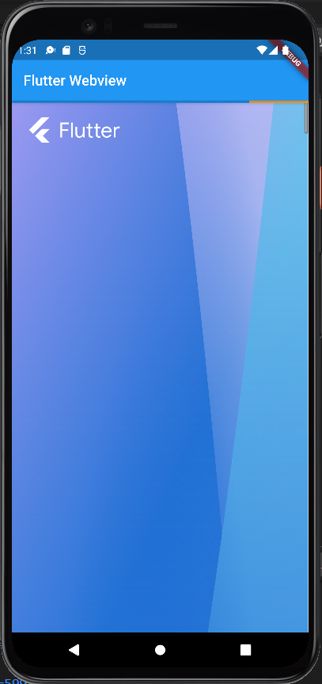
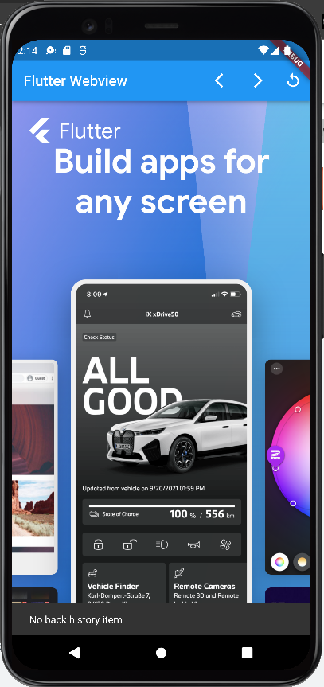
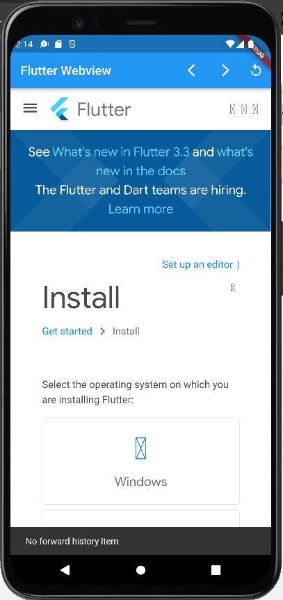
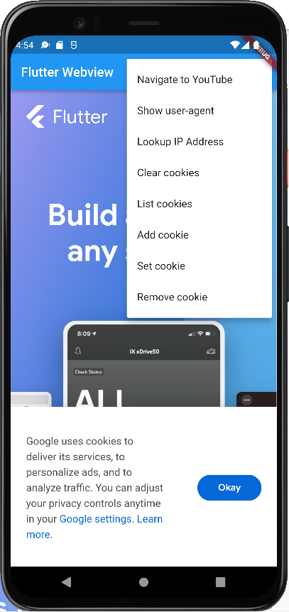
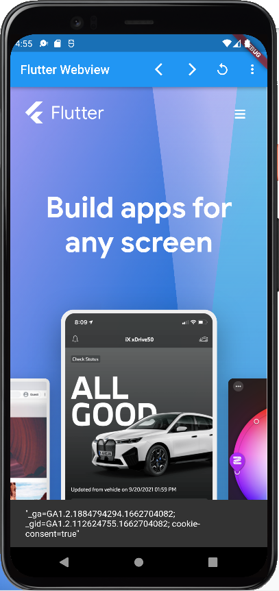
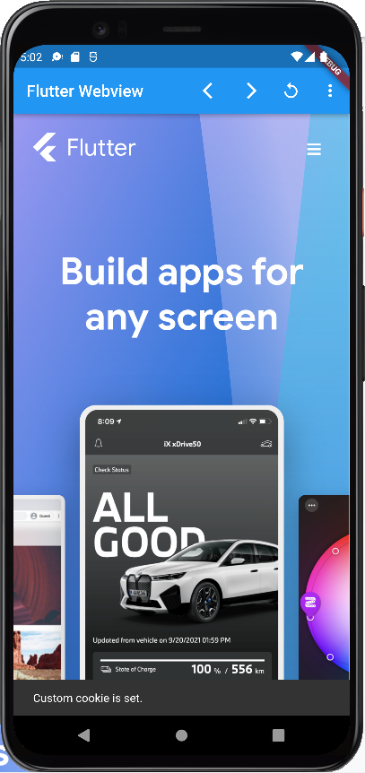

# flutter_webview

A new Flutter project.

## Konfigurasi project flutter

  Membuat project flutter baru

            $ flutter create webview_in_flutter
            Creating project webview_in_flutter...
            [Listing of created files elided]
            Wrote 81 files.

            All done!
            In order to run your application, type:

            $ cd webview_in_flutter
            $ flutter run

            Your application code is in webview_in_flutter\lib\main.dart.

  Menambahkan plugin webview_in_flutter di pubspec.yaml

            $ cd webview_in_flutter
            $ flutter pub add webview_flutter
            Resolving dependencies...

  Konfigurasi versi SDK agar bisa menggunakan mode *hybrid composition* atau *virtual display*

            defaultConfig {
                // TODO: Specify your own unique Application ID (https://developer.android.com/studio/build/application-id.html).
                applicationId "com.example.webview_in_flutter"
                minSdkVersion 20        // MODIFY
                targetSdkVersion 30
                versionCode flutterVersionCode.toInteger()
                versionName flutterVersionName
            }

## Menambahkan widget webview di aplikasi Flutter

  Mengganti properti body dari Scaffold di class widget WebViewApp agar mengembalikana widget WebView dari paket webview_in_flutter

            import 'package:flutter/material.dart';
            import 'package:webview_flutter/webview_flutter.dart';

            void main() {
              runApp(
                const MaterialApp(
                  home: WebViewApp(),
                ),
              );
            }

            class WebViewApp extends StatefulWidget {
              const WebViewApp({super.key});

              @override
              State<WebViewApp> createState() => _WebViewAppState();
            }

            class _WebViewAppState extends State<WebViewApp> {
              @override
              void initState() {
                super.initState();
              }

              @override
              Widget build(BuildContext context) {
                return Scaffold(
                  appBar: AppBar(
                    title: const Text('Flutter WebView'),
                  ),
                  body: const WebView(
                    initialUrl: 'https://flutter.dev',
                  ),
                );
              }
            }

  Mengenable mode *hybrid composition*.
  Mengimpor paket dart:io

              import 'dart:io'; 

      menambahkan kondisi di method initstate dari class WebViewApp

              @override
              void initState() {
                if (Platform.isAndroid) {
                  WebView.platform = SurfaceAndroidWebView(); 
                }
                super.initState();
              }
          
  Hasil implementasi

  Hasil  |
  ------------- |
    |

## Menambahkan efek page load event (efek loading)

  Membuat class baru dengan nama WebViewStack yang menerapkan Stateful. Di method build mengembalikan widget Stack yang mana widget dapat menumpuk widget lain diatasnya. Widget Stack mengembalikan array of widget yang bisa menampung banyak widget sekaligus.
pada children diisi dengan widget WebView, dengan properti yang harus diisi adalah 'initialUrl'. Kemudian agar bisa membuat efek loading maka perlu mengisi properti lain seperti onPageStarted, onProgress, dan onPageFinished, yang mana properti ini akan memperbarui state dari nilai loadingPercentage dan memperbarui tampilan di layar.
  
    import 'package:flutter/material.dart';
    import 'package:webview_flutter/webview_flutter.dart';

    class WebViewStack extends StatefulWidget {
      const WebViewStack({super.key});

      @override
      State<WebViewStack> createState() => _WebViewStackState();
    }

    class _WebViewStackState extends State<WebViewStack> {
      var loadingPercentage = 0;

      @override
      Widget build(BuildContext context) {
        return Stack(
          children: [
            WebView(
              initialUrl: 'https://flutter.dev',
              onPageStarted: (url) {
                setState(() {
                  loadingPercentage = 0;
                });
              },
              onProgress: (progress) {
                setState(() {
                  loadingPercentage = progress;
                });
              },
              onPageFinished: (url) {
                setState(() {
                  loadingPercentage = 100;
                });
              },
            ),
            if (loadingPercentage < 100)
              LinearProgressIndicator(
                value: loadingPercentage / 100.0,
              ),
          ],
        );
      }
    }

  Memodifikasi method build dari class WebViewApp.
  
    @override
      Widget build(BuildContext context) {
        return Scaffold(
          appBar: AppBar(
            title: const Text('Flutter WebView'),
          ),
          body: const WebViewStack(),   // Replace the WebView widget with WebViewStack
        );
      }
  
  Hasil
  
  Hasil  |
  ------------- |
    |
  
## Menerapkan WebViewController
  
  Memodifikasi class WebViewStack agar bisa menerima controller WebViewController. Controller ini bersifat asinkron dimana kembaliannya bertipe Completer.
    
    class WebViewStack extends StatefulWidget {
      const WebViewStack({required this.controller, super.key}); // Modify 

      final Completer<WebViewController> controller;   // Add this attribute

      @override
      State<WebViewStack> createState() => _WebViewStackState();
    }

    class _WebViewStackState extends State<WebViewStack> {
      var loadingPercentage = 0;

      @override
      Widget build(BuildContext context) {
        return Stack(
          children: [
            WebView(
              initialUrl: 'https://flutter.dev',
              onWebViewCreated: (webViewController) {
                widget.controller.complete(webViewController);
              },
              // ..

  Membuat class Navigation Controls
  
    import 'dart:async';
    import 'package:flutter/material.dart';
    import 'package:webview_flutter/webview_flutter.dart';

    class NavigationControls extends StatelessWidget {
      const NavigationControls({required this.controller, super.key});

      final Completer<WebViewController> controller;

      @override
      Widget build(BuildContext context) {
        return FutureBuilder<WebViewController>(
          future: controller.future,
          builder: (context, snapshot) {
            final WebViewController? controller = snapshot.data;

            if (snapshot.connectionState != ConnectionState.done ||
                controller == null) {
              return Row(
                children: [
                  Icon(Icons.arrow_back_ios),
                  Icon(Icons.arrow_forward_ios),
                  Icon(Icons.replay),
                ],
              );
            }

            return Row(
              children: [
                IconButton(
                  icon: const Icon(Icons.arrow_back_ios),
                  onPressed: () async {
                    if (await controller.canGoBack()) {
                      await controller.goBack();
                    } else {
                      ScaffoldMessenger.of(context).showSnackBar(
                        const SnackBar(content: Text('No back history item')),
                      );
                      return;
                    }
                  },
                ),
                IconButton(
                  icon: const Icon(Icons.arrow_forward_ios),
                  onPressed: () async {
                    if (await controller.canGoForward()) {
                      await controller.goForward();
                    } else {
                      ScaffoldMessenger.of(context).showSnackBar(
                        const SnackBar(content: Text('No forward history item')),
                      );
                      return;
                    }
                  },
                ),
                IconButton(
                  icon: const Icon(Icons.replay),
                  onPressed: () {
                    controller.reload();
                  },
                ),
              ],
            );
          },
        );
      }
    }
    
  Menambahkan navigation controls ke properti action di AppBar dari class WebViewApp
  
    @override
    Widget build(BuildContext context) {
      return Scaffold(
        appBar: AppBar(
          title: const Text('Flutter WebView'),
          actions: [
            NavigationControls(controller: controller),
          ],
        ),
    body: WebViewStack(controller: controller),
    
  Hasil
  
  Hasil 1  | Hasil 2
  ------------- | -------------
    | 
  
## Mengelola cookie

  Agar bisa mengumpulkan informasi di website seperti info login, pengaturan tema, bahasa dsb. Maka diperlukan sebuah cookie.
  
  Membuat inisiasi variabel yang akan menjadi option yang bisa dipilih.
  
    enum _MenuOptions {
      navigationDelegate,
      userAgent,
      javascriptChannel,
      // Add from here ...
      listCookies,
      clearCookies,
      addCookie,
      setCookie,
      removeCookie,
      // ... to here.
    }
    
  Pengolahan cookie diproses oleh CookieManager. Membuat objek dari CookieManager
    
      class Menu extends StatefulWidget {
        const Menu({required this.controller, super.key});

        final Completer<WebViewController> controller;

        @override
        State<Menu> createState() => _MenuState();
      }

      class _MenuState extends State<Menu> {
        final CookieManager cookieManager = CookieManager();       // Add this line

        @override
        Widget build(BuildContext context) {
        // ...
    
  Membuat method yang bisa menampilkan daftar cookie, menghapus, menambah, set, dan nonaktifkan cookie
    
      Future<void> _onListCookies(WebViewController controller) async {
        final String cookies =
            await controller.runJavascriptReturningResult('document.cookie');
        if (!mounted) return;
        ScaffoldMessenger.of(context).showSnackBar(
          SnackBar(
            content: Text(cookies.isNotEmpty ? cookies : 'There are no cookies.'),
          ),
        );
      }
      
      Future<void> _onClearCookies() async {
        final hadCookies = await cookieManager.clearCookies();
        String message = 'There were cookies. Now, they are gone!';
        if (!hadCookies) {
          message = 'There were no cookies to clear.';
        }
        if (!mounted) return;
        ScaffoldMessenger.of(context).showSnackBar(
          SnackBar(
            content: Text(message),
          ),
        );
      }

      Future<void> _onAddCookie(WebViewController controller) async {
        await controller.runJavascript('''var date = new Date();
      date.setTime(date.getTime()+(30*24*60*60*1000));
      document.cookie = "FirstName=John; expires=" + date.toGMTString();''');
        if (!mounted) return;
        ScaffoldMessenger.of(context).showSnackBar(
          const SnackBar(
            content: Text('Custom cookie added.'),
          ),
        );
      }

      Future<void> _onSetCookie(WebViewController controller) async {
        await cookieManager.setCookie(
            const WebViewCookie(name: 'foo', value: 'bar', domain: 'flutter.dev'));
        if (!mounted) return;
        ScaffoldMessenger.of(context).showSnackBar(
          const SnackBar(
            content: Text('Custom cookie is set.'),
          ),
        );
      }

      Future<void> _onRemoveCookie(WebViewController controller) async {
        await controller.runJavascript(
            'document.cookie="FirstName=John; expires=Thu, 01 Jan 1970 00:00:00 UTC" ');
        if (!mounted) return;
        ScaffoldMessenger.of(context).showSnackBar(
          const SnackBar(
            content: Text('Custom cookie removed.'),
          ),
        );
      }
      
  Menambahkan menu opsi untuk pengolahan Cookie
    
      const PopupMenuItem<_MenuOptions>(
        value: _MenuOptions.clearCookies,
        child: Text('Clear cookies'),
      ),
      const PopupMenuItem<_MenuOptions>(
        value: _MenuOptions.listCookies,
        child: Text('List cookies'),
      ),
      const PopupMenuItem<_MenuOptions>(
        value: _MenuOptions.addCookie,
        child: Text('Add cookie'),
      ),
      const PopupMenuItem<_MenuOptions>(
        value: _MenuOptions.setCookie,
        child: Text('Set cookie'),
      ),
      const PopupMenuItem<_MenuOptions>(
        value: _MenuOptions.removeCookie,
        child: Text('Remove cookie'),
      ),
      
  Hasil implementasi
  
  Tampilan Menu |
  ------------- |
   |

  Daftar Cookie  | Hapus Cookie | Tambah Cookie | Set Cookie |
  ------------- | ------------- | ------------- | ------------- |
    |   |  |  |
